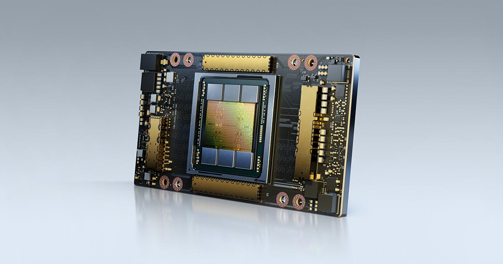
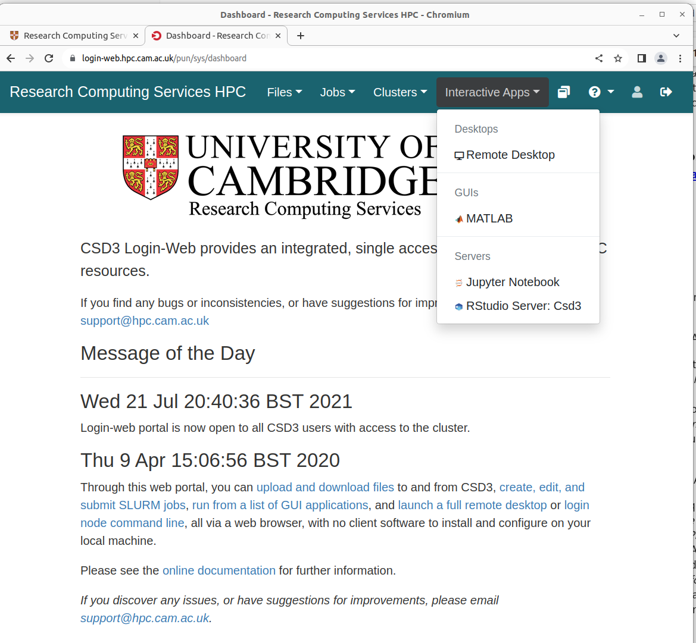
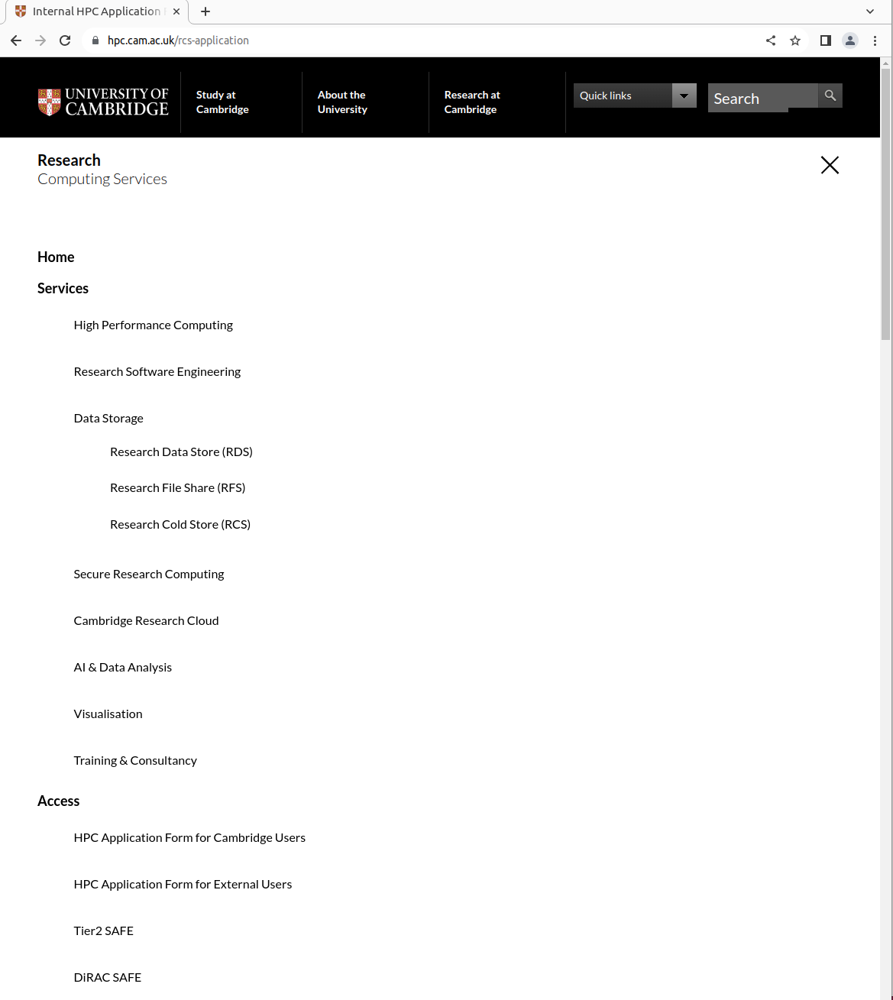
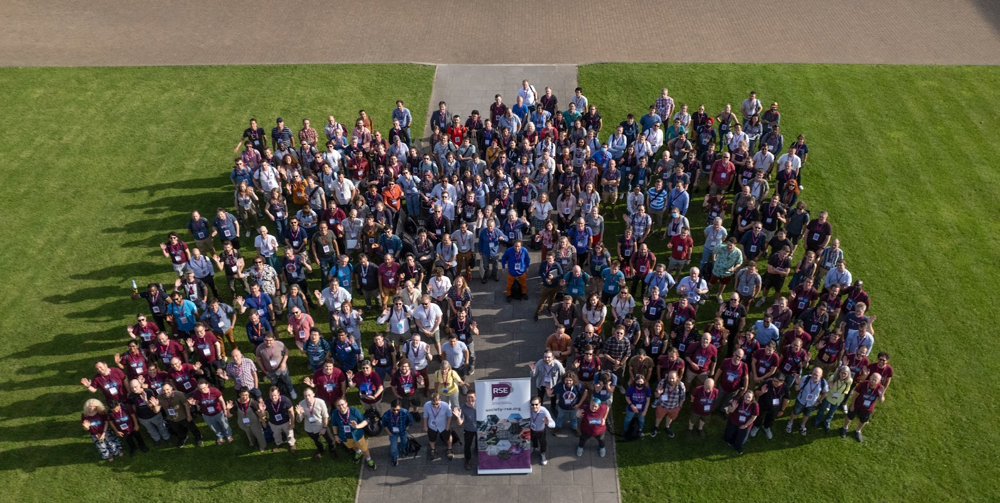
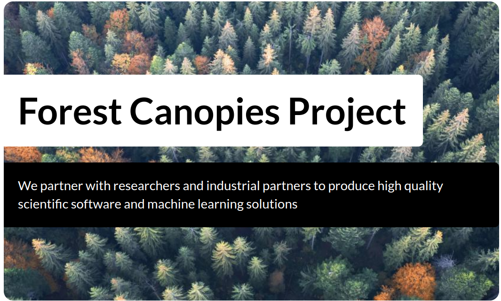
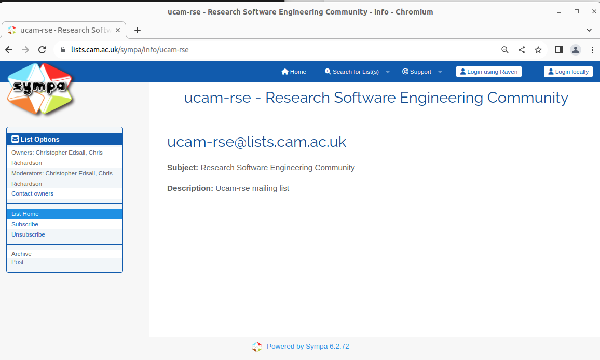
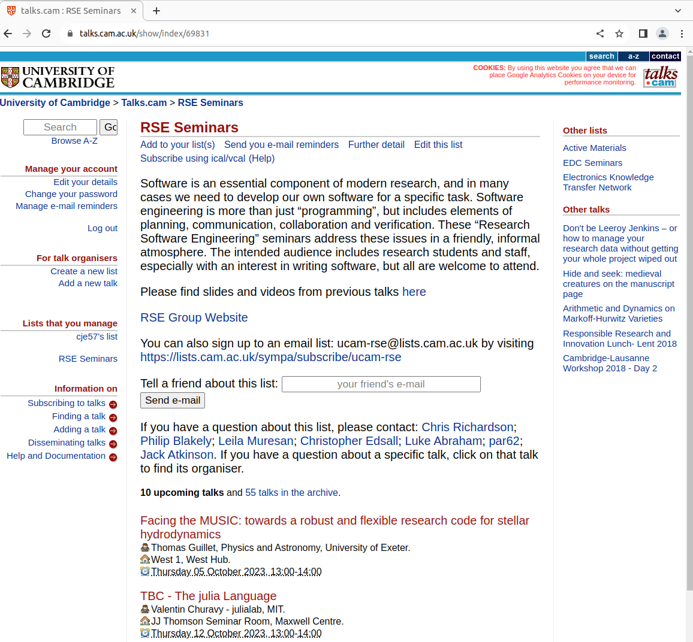

# HPC

## CSD3

- Cambridge's own supercomputer
- CSD2
  - Cumulus (CPU parts)
  - Wilkes3 (GPU parts)

## CPUs

- Intel
  - Cascade Lake 37k cores
  - Ice Lake 42k cores
  - Sapphire Rapids 12k cores

## GPUs
::: columns

:::: column
- 80x Dell PowerEdge XE8545 servers, each with​
- 2x 3rd Generation AMD EPYC 64-Core CPUs
- 1 TB memory​
- 4x NVIDIA A100-SXM-80GB GPUs​
- 2x HDR 200 Gbit InfiniBand network.
::::

:::: column

::::

:::

## Software

::: columns

:::: column
  
- Python
  - PyTorch
  - TensorFlow
  - Dask
  - Alphafold
- R
  - RStudio
- Julia
  - Talk to us!

::::

:::: column

::::

:::

## Browser Based Access

::: columns

:::: column
- https://login-web.hpc.cam.ac.uk/
- "Open On Demand"
- Broser based access
- Jupyter Notebooks
- R Studio
::::

:::: column

::::

:::

## How to get access

::: columns

:::: column
- https://www.hpc.cam.ac.uk/
- "HPC Application Form for Cambridge Users"
- SL3 free (lower priroity)
- can pay for higher priority
::::

:::: column

::::

:::

# RSE

## Research Software Engineering

::: columns

:::: column

::::

:::: column

::::

:::

## Case Study - Forest Canopies

::: columns

:::: column

::::

:::: column

::::

:::

## Mailing List - ucam-rse

::: columns

:::: column
- on lists.cam.ac.uk
- ~70 subscribers
- low volume
::::

:::: column

::::

:::

## Talks

::: columns

:::: column
- Seminar series
  - on talks.cam.ac.uk
  - search "RSE Seminars"
- Computation day
  - full day of talks from researchers
  - posters
  - delayed from end of Sept until next term
::::

:::: column

::::

:::

## Thank You

- cje57@cam.ac.uk
- https://www.hpc.cam.ac.uk/
- https://docs.hpc.cam.ac.uk/
- support@hpc.cam.ac.uk
